---
hide:
  - navigation
---

# Agentic AI Solution Accelerator

> **A GitHub template that Microsoft partners clone to deliver a customer-specific agentic AI solution — live in days, not months.** Full engagement motion (discovery → UAT → handover → measure) is weeks, and documented honestly below.

**Flagship scenario:** Sales Research & Personalized Outreach — a supervisor agent routes a research request across specialist workers (Account Researcher, ICP/Fit Analyst, Competitive Context, Outreach Personalizer) and returns a grounded, citeable sales brief with a CRM-ready outreach draft. **Human-in-the-loop gates every CRM write and every email send.**

**Stack:** Microsoft Agent Framework · Azure AI Foundry · Azure AI Search · Managed Identity · Key Vault · Container Apps · Application Insights · `azd` for infra.

!!! tip "New here? Start in three moves"
    1. **Scan the workflow below** — one picture shows all 7 stages across the three lanes (Lead / Engineer / Ops).
    2. **Pick your lane** in the tabs further down — each one tells you the first action and how you know you're done.
    3. **Open the Getting started guide** when you're ready to act: [5-step quickstart →](getting-started/index.md)

[:material-rocket-launch: Get started](getting-started/index.md){ .md-button .md-button--primary }
[:material-book-open-page-variant: Partner playbook](partner-playbook.md){ .md-button }
[:material-map-marker-path: Full workflow map](partner-workflow.md){ .md-button }

---

## The workflow at a glance

Click any node to jump to its first-action doc.

```mermaid
flowchart LR
    classDef lead fill:#E1F0FF,stroke:#1F6FEB,color:#0B3D91,stroke-width:1px;
    classDef eng  fill:#E8F5E9,stroke:#2E7D32,color:#1B5E20,stroke-width:1px;
    classDef ops  fill:#FFF3E0,stroke:#EF6C00,color:#4E342E,stroke-width:1px;

    subgraph DL["👤 Delivery Lead"]
        direction LR
        D1["<b>1. Scope + discover</b><br/>canvas → workshop<br/><i>or</i> /ingest-prd → gap-fill"]
        D5["<b>5. UAT sign-off</b><br/>customer sponsor<br/>walks acceptance evals"]
        D6["<b>6. Handover meeting</b><br/>walk packet + runbook<br/>with customer ops"]
        D7["<b>7. Monthly value review</b><br/>ROI KPIs vs hypothesis"]
    end

    subgraph PE["🛠️ Partner Engineer"]
        direction LR
        E1["<b>2. Scaffold from brief</b><br/>/scaffold-from-brief<br/><i>first time: run hands-on-lab</i>"]
        E2["<b>3. Provision customer Azure</b><br/>azd up → Foundry · Search · KV · ACA"]
        E3["<b>4. Iterate with Copilot</b><br/>PRs gated by lint + evals + redteam"]
        E4["<b>5. UAT support</b><br/>eval tuning · HITL wiring · fixes"]
    end

    subgraph CO["🏛️ Customer Ops"]
        direction LR
        C1["<b>6. Receive handover packet</b><br/>endpoint URLs · HITL approvers<br/>alerts · rollback · SLAs"]
        C2["<b>7. Ongoing day-2 ops</b><br/>monitor · killswitch · eval re-run<br/>secret rotation · model swap"]
    end

    D1 --> E1
    E1 --> E2 --> E3 --> E4
    E4 --> D5
    D5 --> D6 --> C1
    C1 --> C2
    C2 -. usage signal .-> D7
    C2 -. new feature / expansion request .-> D1

    class D1,D5,D6,D7 lead;
    class E1,E2,E3,E4 eng;
    class C1,C2 ops;

    click D1 "discovery/how-to-use/" "Discovery kit — canvas → workshop (or /ingest-prd branch)"
    click D5 "partner-playbook/#stage-5--uat" "Stage 5 — UAT sign-off"
    click D6 "handover/handover-packet-template/" "Handover packet template"
    click D7 "partner-playbook/#stage-7--measure" "Stage 7 — Monthly value review"
    click E1 "QUICKSTART/#step-3--scaffold-the-solution-from-the-brief" "QUICKSTART Step 3 — Scaffold from brief"
    click E2 "getting-started/" "Setup & prereqs — azd up + troubleshooting"
    click E3 "QUICKSTART/#step-4--provision--deploy-to-customers-azure" "QUICKSTART Steps 4–5 — iterate through CI gates"
    click E4 "partner-playbook/#stage-5--uat" "Stage 5 — Engineer UAT support"
    click C1 "customer-runbook/" "Customer runbook (fallback) — your handover packet supersedes it"
    click C2 "customer-runbook/" "Customer runbook (fallback) — your handover packet supersedes it"
```

---

## Pick your lane

=== "🧭 Delivery Lead"

    **You own:** scope, discovery workshop, SOW, UAT sign-off, handover meeting, monthly value review.

    - **Start with:** [Partner playbook](partner-playbook.md) — end-to-end 7-stage motion, SOW guidance, "what good looks like" per stage.
    - **Then run:** `/delivery-guide` in Copilot Chat for a guided pass through the motion.
    - **Also use:** [Discovery guide](discovery/how-to-use.md) · [Handover template](handover/handover-packet-template.md)
    - **Customer already gave you a PRD/BRD/spec?** Run `/ingest-prd` to pre-draft the brief, then `/discover-scenario` gap-fills. Full flow inside [how-to-use.md](discovery/how-to-use.md).

    !!! success "Done when"
        Customer sponsor signs off at UAT (Stage 5), handover packet is delivered with a named owner and date (Stage 6), and the first monthly value review is on the calendar (Stage 7).

=== "🛠️ Partner Engineer"

    **You own:** scaffold, provision, iterate, acceptance evals, UAT support, engagement handover artifacts.

    - **Start with:** [5-step quickstart](getting-started/index.md) — mechanics from clone to customer deploy.
    - **Then run:** `/scaffold-from-brief` once a solution brief exists (engineer's interactive equivalent of the lead's `/delivery-guide`).
    - **Also use:** [Setup & prereqs](getting-started/setup-and-prereqs.md) (authoritative `azd up` troubleshooting) · [Hands-on lab](enablement/hands-on-lab.md)

    !!! warning "First customer engagement? Run the hands-on-lab first"
        The [7-lab sandbox](enablement/hands-on-lab.md) rehearses every chatmode + `azd up` + PR gates against a throwaway subscription. Skipping this is the #1 cause of avoidable first-engagement incidents.

    !!! success "Done when"
        Acceptance evals (quality + redteam) pass in the customer's environment **and** handover artifacts — repo access, runbook, approver rota, killswitch drill notes — are delivered to customer ops.

=== "🏛️ Customer Ops"

    **You own:** day-2 operations after the partner hands over — monitoring, HITL approver rotation, incidents, drills, expansion intake.

    - **Primary:** Your engagement-specific handover packet (the partner delivers this at Stage 6).
    - **Fallback:** [Day-2 runbook](customer-runbook.md) — generic monitoring, killswitch, evals, model swap, secret rotation, incidents. **Partner packet wins on conflict.**

    !!! success "Done when (handover accepted)"
        Alerts route to your on-call, HITL approver rota is current, killswitch + secret-rotation drills have been run once, and you know which partner contact handles expansion requests. *Day-2 ops is steady-state, not a finish line.*

!!! note "Wearing multiple hats at a small partner?"
    The lanes above are **responsibilities, not job titles**. **Solo partner:** run the Lead lane top-to-bottom through Stage 1; drop into the Engineer lane at Stage 2 (scaffold → provision → iterate); return to the Lead lane at Stage 5 (UAT) through Stage 7. **Customer ops is always the customer's lane** — not something the partner wears.

---

## Reference material

!!! abstract "When guidance conflicts, use this precedence"
    Chatmodes in `.github/chatmodes/` (they drive the executable surface) → [Partner playbook](partner-playbook.md) (delivery motion) and [Setup & prereqs](getting-started/setup-and-prereqs.md) (mechanics) → this home page. The engagement-specific handover packet supersedes the generic [customer runbook](customer-runbook.md) for the customer ops lane.

-   :material-sitemap: **Patterns & compliance**

    ---

    [Reference architecture](patterns/architecture/README.md) · [WAF alignment](patterns/waf-alignment/README.md) · [Responsible AI](patterns/rai/README.md) · [Azure AI landing zone](patterns/azure-ai-landing-zone/README.md)

-   :material-application-braces: **Scenario walkthroughs**

    ---

    [Customer service actioning](references/customer-service-actioning/README.md) · [RFP response](references/rfp-response/README.md)

-   :material-wrench-cog: **Engineer deep-dives**

    ---

    [Tool catalog](foundry-tool-catalog.md) · [Agent specs](agent-specs/README.md) · [Version matrix](version-matrix.md) · [Architecture](patterns/architecture/README.md)

-   :material-github: **Repository**

    ---

    [GitHub repo](https://github.com/Azure-Samples/agentic-ai-solution-accelerator) · [Chatmodes](chatmodes/delivery-guide.chatmode.md) · [Contributing](about/CONTRIBUTING.md)

