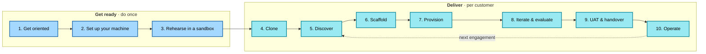

---
hide:
  - navigation
---

# Agentic AI Solution Accelerator

> **A GitHub template that Microsoft partners clone to deliver a customer-specific agentic AI solution — live in days, not months.** The full engagement motion (discovery → UAT → handover → measure) is weeks, and walked step-by-step below.

**Flagship scenario:** Sales Research & Personalised Outreach — a supervisor agent routes a research request across specialist workers (Account Researcher, ICP/Fit Analyst, Competitive Context, Outreach Personaliser) and returns a grounded, citeable sales brief with a CRM-ready outreach draft. **Human-in-the-loop gates every CRM write and every email send.**

**Stack:** Microsoft Agent Framework · Microsoft Foundry · Azure AI Search · Managed Identity · Key Vault · Container Apps · Application Insights · `azd` for infra.

---

## How this site is organised

The accelerator is delivered as a **linear walkthrough** in two tracks. Read in order; each step ends with a single **Continue →** link to the next.

- **[Get ready](start/ready/01-get-oriented.md)** *(3 steps, do once)* — orient yourself, install your tools, rehearse in your own sandbox.
- **[Deliver to a customer](start/deliver/01-clone-for-the-customer.md)** *(7 steps, repeat per engagement)* — clone, discover, scaffold, provision, iterate, hand over, operate.

Roles are skim guidance, not separate paths:

| Role | Read deeply | Skim |
|---|---|---|
| **Delivery lead** | *Get oriented*, *Discover with the customer*, *UAT & handover*, *Operate (Day 2)* | The engineering steps |
| **Partner engineer** | *Set up your machine*, *Rehearse in a sandbox*, *Clone* through *Iterate & evaluate* | *Get oriented* |
| **Solo partner** | All 10 steps | — |

[:material-rocket-launch: Start with **1. Get oriented** →](start/ready/01-get-oriented.md){ .md-button .md-button--primary }

---

## Joining mid-engagement?

Jump in at the step that matches your current state.

| If this is true… | Start at |
|---|---|
| You haven't cloned the customer repo yet | [4. Clone for the customer](start/deliver/01-clone-for-the-customer.md) |
| Repo is cloned, no brief yet | [5. Discover with the customer](start/deliver/02-discover-with-the-customer.md) |
| Brief is filled in the repo, no scaffold yet | [6. Scaffold from the brief](start/deliver/03-scaffold-from-the-brief.md) |
| Code scaffolded, not provisioned in customer Azure | [7. Provision the customer's Azure](start/deliver/04-provision-the-customers-azure.md) |
| Provisioned, you're customising and running evals | [8. Iterate & evaluate](start/deliver/05-iterate-and-evaluate.md) |
| Evals green, heading into UAT | [9. UAT & handover](start/deliver/06-uat-and-handover.md) |
| Already in production | [10. Operate (Day 2)](start/deliver/07-operate-day-2.md) |

---

## Reference material

Deep dives that sit **outside** the walkthrough — open them when a step sends you there.

### Common tasks (jump straight to the chatmode or page you need)

| If you want to… | Go to |
|---|---|
| See which chatmode runs at which step | [Chatmodes overview](agents-index.md) |
| Add a side-effect tool with HITL baked in | [`/add-tool`](../.github/agents/add-tool.agent.md) (used in step 8) |
| Add a specialist worker agent | [`/add-worker-agent`](../.github/agents/add-worker-agent.agent.md) (used in step 8) |
| Scaffold the customer's repo from a filled brief | [`/scaffold-from-brief`](../.github/agents/scaffold-from-brief.agent.md) (used in step 6) |
| Onboard a new Azure environment (dev/UAT/prod) | [`/deploy-to-env`](../.github/agents/deploy-to-env.agent.md) (used in step 7) |
| Pick a landing-zone tier (standalone / AVM / ALZ-integrated) | [`/configure-landing-zone`](../.github/agents/configure-landing-zone.agent.md) (used in step 7) |
| Preflight a change against lint / eval / deploy gates | [`/explain-change`](../.github/agents/explain-change.agent.md) (used in step 8) |
| Re-author the scenario as single-agent or chat-with-actioning | [`/switch-to-variant`](../.github/agents/switch-to-variant.agent.md) (used in step 8) |

### Deep dives

- **Architecture & governance** — [Reference architecture](patterns/architecture/README.md) · [Azure AI landing zone](patterns/azure-ai-landing-zone/README.md) · [WAF alignment](patterns/waf-alignment/README.md) · [Responsible AI](patterns/rai/README.md)
- **Engineering reference** — [Agent specs](agent-specs/README.md) · [Tool catalog](foundry-tool-catalog.md) · [Version matrix](version-matrix.md)
- **Frontend starter** — [`patterns/sales-research-frontend/`](patterns/sales-research-frontend/README.md)
- **Reference scenarios** — [Customer service actioning](references/customer-service-actioning/README.md) · [RFP response](references/rfp-response/README.md)
- **Delivery context** — [Partner playbook](partner-playbook.md) (narrative companion to the walkthrough) · [Solution brief guide](discovery/SOLUTION-BRIEF-GUIDE.md) · [Handover template](handover/handover-packet-template.md) · [Workflow map](partner-workflow.md)

[:material-github: GitHub repo](https://github.com/Azure-Samples/agentic-ai-solution-accelerator) · [Contributing](about/CONTRIBUTING.md) · [Support](about/SUPPORT.md)

---

## Returning for the next customer?

Track 1 (*Get ready*) stays done. Skip straight to **[4. Clone for the customer](start/deliver/01-clone-for-the-customer.md)** and run through Track 2 again with the new customer's short-name. The accelerator is built to support multiple customer engagements from one prepared workstation.

Quick preflight before the next engagement:

- [ ] `gh auth status` succeeds and you can see the customer's GitHub org.
- [ ] `az account list` includes the customer's tenant; partner has rights in their target subscription.
- [ ] `accelerator-lint.py` is green on the latest commit of the template (`main`).
- [ ] You've reviewed any version-matrix updates from the weekly CI run.

---

## Glossary

Acronyms used across these docs, in one place.

| Term | Meaning |
|---|---|
| **ALZ** | Azure Landing Zone — Microsoft's reference architecture for an enterprise Azure tenancy (hub vNet, private DNS, MG hierarchy, policy). |
| **AVM** | Azure Verified Modules — Microsoft-maintained Bicep/Terraform modules following Azure best practices. |
| **BYO** | Bring Your Own — partner supplies the Azure subscription / tenant / identity, accelerator deploys into it. |
| **CCoE** | Cloud Center of Excellence — the customer team that owns Azure platform standards, ALZ, policy. |
| **HITL** | Human-in-the-Loop — required human approval gate before any side-effect tool call (CRM write, email send, etc.). |
| **MG** | Management Group — Azure's tenancy-scoped policy + RBAC container above subscriptions. |
| **OIDC** | OpenID Connect — token-based federated auth; used here so GitHub Actions can deploy to Azure without a service-principal secret. |
| **RAG** | Retrieval-Augmented Generation — pattern of grounding LLM responses in indexed sources (here, Azure AI Search). |
| **RAI** | Responsible AI — Microsoft's safety practice (content filters, redteam evals, PII handling, transparency). |
| **RBAC** | Role-Based Access Control — Azure's identity-based permission model. |
| **SSE** | Server-Sent Events — one-way streaming HTTP protocol the scenario endpoint uses to push agent progress to clients. |
| **WAF** | Well-Architected Framework — Microsoft's five-pillar architecture review (reliability, security, cost, op-ex, performance). |
