# Partner workflow — visual navigation map

> **This page is a navigation map, not a source of truth.** Authoritative
> instructions live in the linked docs. If the diagram and a linked doc
> disagree, the linked doc wins.

> **Responsibilities, not job titles.** At a small partner, one person
> may wear all three hats. The lanes below show *who does what when*,
> not who must be hired.

This is the partner-facing end-to-end motion for cloning the
accelerator and shipping a customer-specific agentic AI solution. The
diagram below maps three responsibilities (Delivery Lead · Partner
Engineer · Customer Ops) across the seven stages of
[`docs/partner-playbook.md`](partner-playbook.md) (discover → scaffold
→ provision → iterate → UAT → handover → measure).

Every node is clickable — it links to the one doc that owns the
instructions for that step.

---

## The workflow

```mermaid
flowchart LR
    classDef lead fill:#E1F0FF,stroke:#1F6FEB,color:#0B3D91,stroke-width:1px;
    classDef eng  fill:#E8F5E9,stroke:#2E7D32,color:#1B5E20,stroke-width:1px;
    classDef ops  fill:#FFF3E0,stroke:#EF6C00,color:#4E342E,stroke-width:1px;

    subgraph DL["👤 Delivery Lead"]
        direction LR
        D1["<b>1. Scope + discover</b><br/>canvas → workshop<br/><i>or</i> /ingest-prd → gap-fill"]
        D5["<b>5. UAT sign-off</b><br/>review acceptance evals<br/>with customer sponsor"]
        D6["<b>6. Handover meeting</b><br/>walk packet + runbook<br/>with customer ops"]
        D7["<b>7. Monthly value review</b><br/>ROI KPIs vs hypothesis"]
    end

    subgraph PE["🛠️ Partner Engineer"]
        direction LR
        E1["<b>2. Scaffold from brief</b><br/>/scaffold-from-brief<br/><i>first time: run hands-on-lab</i>"]
        E2["<b>3. Provision customer Azure</b><br/>azd up → Foundry · Search · KV · ACA"]
        E3["<b>4. Iterate with Copilot</b><br/>PRs gated by lint + evals + redteam"]
        E4["<b>5. UAT support</b><br/>eval tuning · HITL wiring · fixes"]
    end

    subgraph CO["🏛️ Customer Ops"]
        direction LR
        C1["<b>6. Receive handover packet</b><br/>endpoint URLs · HITL approvers<br/>alerts · rollback · SLAs"]
        C2["<b>7. Day-2 ops + incidents</b><br/>monitor · killswitch · eval re-run<br/>secret rotation · model swap"]
    end

    D1 --> E1
    E1 --> E2 --> E3 --> E4
    E4 --> D5
    D5 --> D6 --> C1
    C1 --> C2
    C2 -. incidents + usage signal .-> D7

    class D1,D5,D6,D7 lead;
    class E1,E2,E3,E4 eng;
    class C1,C2 ops;

    click D1 "discovery/how-to-use.md" "Discovery kit sequence (includes PRD/BRD branch)"
    click D5 "partner-playbook.md#stage-5--uat" "Stage 5 — UAT"
    click D6 "partner-playbook.md#stage-6--production-handover" "Stage 6 — Production handover"
    click D7 "partner-playbook.md#stage-7--measure" "Stage 7 — Measure"
    click E1 "partner-playbook.md#stage-2--scaffold" "Stage 2 — Scaffold"
    click E2 "partner-playbook.md#stage-3--provision" "Stage 3 — Provision"
    click E3 "partner-playbook.md#stage-4--iterate" "Stage 4 — Iterate"
    click E4 "partner-playbook.md#stage-5--uat" "Stage 5 — UAT (engineer view)"
    click C1 "customer-runbook.md" "Customer day-2 runbook (+ partner handover packet wins on conflict)"
    click C2 "customer-runbook.md" "Customer ops — monitoring, killswitch, incidents"
```

---

## Node reference (same as the diagram)

Each row states **why this step matters**. "Authority" is the doc that owns the motion; "Start with" is the first action-oriented doc to read. What to do lives in those docs.

| # | Who | Step | Why | Authority | Start with |
|---|---|---|---|---|---|
| D1 | Delivery Lead | Scope + discover | Decides whether the engagement is workshop-ready, produces the solution brief + ROI hypothesis that drives everything downstream. Supports both blank-start (canvas → workshop) and PRD-in-hand (`/ingest-prd` pre-drafts, `/discover-scenario` gap-fills). | [Playbook Stage 1](partner-playbook.md#stage-1--discovery) | [`discovery/how-to-use.md`](discovery/how-to-use.md) |
| E1 | Partner Engineer | Scaffold from brief | `/scaffold-from-brief` turns the brief into working code — prompts, tools, retrieval, HITL, evals, manifest. First-timers must run the lab once so the scaffold doesn't land in unfamiliar bones. | [Playbook Stage 2](partner-playbook.md#stage-2--scaffold) | [`enablement/hands-on-lab.md`](enablement/hands-on-lab.md) (first time) → then `/scaffold-from-brief` |
| E2 | Partner Engineer | Provision customer Azure | `azd up` provisions Foundry + Search + KV + ACA + App Insights in the **customer's** subscription with MI. No keys. | [Playbook Stage 3](partner-playbook.md#stage-3--provision) | [`getting-started.md`](getting-started.md) |
| E3 | Partner Engineer | Iterate with Copilot | Every change goes through PRs that lint + quality evals + redteam must pass. Keeps HITL + RAI invariants intact. | [Playbook Stage 4](partner-playbook.md#stage-4--iterate) | [`../QUICKSTART.md`](../QUICKSTART.md) (Steps 4–5) |
| E4 | Partner Engineer | UAT support | Engineer is on-call for eval tuning, HITL approver wiring, and scenario fixes while customer runs UAT against acceptance evals. | [Playbook Stage 5](partner-playbook.md#stage-5--uat) | [`partner-playbook.md`](partner-playbook.md#stage-5--uat) |
| D5 | Delivery Lead | UAT sign-off | Customer sponsor walks the acceptance evals, approves production deploy. Gate before handover. | [Playbook Stage 5](partner-playbook.md#stage-5--uat) | [`partner-playbook.md`](partner-playbook.md#stage-5--uat) |
| D6 | Delivery Lead | Handover meeting | Formal session with customer ops — walk the packet + runbook, confirm approvers, test killswitch, hand over alerts. | [Playbook Stage 6](partner-playbook.md#stage-6--production-handover) | [`handover/handover-packet-template.md`](handover/handover-packet-template.md) |
| C1 | Customer Ops | Receive handover packet | Customer ops owns the deployment from here. The engagement-specific packet is primary; the generic runbook is fallback (packet wins on conflict). | — (customer-owned) | [`customer-runbook.md`](customer-runbook.md) |
| C2 | Customer Ops | Day-2 ops + incidents | Monitoring, killswitch, eval re-run, secret rotation, model swap, incident response. | — (customer-owned) | [`customer-runbook.md`](customer-runbook.md) |
| D7 | Delivery Lead | Monthly value review | Measure realized KPIs against the ROI hypothesis from D1. Feeds the next engagement; justifies renewals. | [Playbook Stage 7](partner-playbook.md#stage-7--measure) | [`partner-playbook.md`](partner-playbook.md#stage-7--measure) |

---

## Lower-frequency steps not in the diagram

These happen inside the stages above but aren't first-order navigation targets:

- **ROI quantification** — fill `docs/discovery/roi-calculator.xlsx` after solution brief §3/§4 are confirmed, during D1. Feeds telemetry KPI names in E1. See [`discovery/how-to-use.md`](discovery/how-to-use.md).
- **Pattern switch** — if the brief's solution shape isn't supervisor-routing, run `/switch-to-variant` during E1 before scaffolding. See [`.github/chatmodes/switch-to-variant.chatmode.md`](../.github/chatmodes/switch-to-variant.chatmode.md).
- **Incident feedback loop** — the dashed arrow `C2 ⇢ D7` represents customer ops surfacing incidents or usage gaps back to the delivery lead for next-engagement learnings; no dedicated chatmode.

---

## Related

- [`partner-playbook.md`](partner-playbook.md) — narrative companion; the 7-stage motion in prose, with "what good looks like" per stage.
- [`../QUICKSTART.md`](../QUICKSTART.md) — 15-minute mechanics summary (for the engineer persona).
- [`../README.md`](../README.md) — the repo-level router.
- [`../.github/chatmodes/`](../.github/chatmodes/) — the executable surface (these win on conflict).
