# Partner workflow — visual navigation map

> **Looking for the step-by-step?** Use the [partner walkthrough](start/index.md). This page is a one-glance map of the same motion — useful for orientation, not for execution.

> **How to use this page:** scan once to orient yourself across the seven
> stages and three responsibilities. Then open the [walkthrough](start/index.md)
> and follow it top-to-bottom. Come back here only if you lose the thread.

> **This page is a navigation map.** Stage *details* (how to run discovery,
> how to scaffold, what "good" looks like) live in the linked docs and win
> on conflict. The [node reference table](#node-reference-same-as-the-diagram)
> below is canonical for **node → first-action doc → playbook stage**
> mapping; if the diagram and the table disagree, the table wins.

> **Responsibilities, not job titles.** At a small partner, one person
> may wear both the Delivery Lead and Partner Engineer hats. The
> Customer Ops lane is always customer-owned — that's who runs the
> solution after handover. The lanes below show *who does what when*,
> not who must be hired.

This is the partner-facing end-to-end motion for cloning the
accelerator and shipping a customer-specific agentic AI solution. The
diagram below maps three responsibilities (Delivery Lead · Partner
Engineer · Customer Ops) across the seven stages of
[`docs/partner-playbook.md`](partner-playbook.md) (discover → scaffold
→ provision → iterate → UAT → handover → measure).

Each node's click target is its **first-action doc** — the thing you
actually open to get moving.

---

## The workflow

```mermaid
%%{init: {'theme':'base','themeVariables':{'fontSize':'16px'},'flowchart':{'nodeSpacing':50,'rankSpacing':80,'htmlLabels':true,'curve':'basis'}}}%%
flowchart LR
    classDef lead fill:#E1F0FF,stroke:#1F6FEB,color:#0B3D91,stroke-width:1px;
    classDef eng  fill:#E8F5E9,stroke:#2E7D32,color:#1B5E20,stroke-width:1px;
    classDef ops  fill:#FFF3E0,stroke:#EF6C00,color:#4E342E,stroke-width:1px;

    subgraph DL["👤 Delivery Lead"]
        direction LR
        D1["<b>1. Scope + discover</b><br/>canvas → workshop<br/><i>or</i> /ingest-prd → gap-fill"]
        D5["<b>5. UAT sign-off</b><br/>review acceptance evals<br/>with customer sponsor"]
        D6["<b>6. Handover meeting</b><br/>walk packet + runbook<br/>with customer ops"]
        D7["<b>7. Monthly value review</b><br/>ROI KPIs vs hypothesis"]
    end

    subgraph PE["🛠️ Partner Engineer"]
        direction LR
        E1["<b>2. Scaffold from brief</b><br/>/scaffold-from-brief<br/><i>first time: run hands-on-lab</i>"]
        EP["<b>3a. Preflight</b><br/>/configure-landing-zone<br/>/deploy-to-env (OIDC + env)"]
        E2["<b>3b. Provision customer Azure</b><br/>azd up → Foundry · Search · KV · ACA"]
        E3["<b>4. Iterate with Copilot</b><br/>PRs gated by lint + evals + redteam"]
        E4["<b>5. UAT support</b><br/>eval tuning · HITL wiring · fixes"]
    end

    subgraph CO["🏛️ Customer Ops"]
        direction LR
        C1["<b>6. Receive handover packet</b><br/>endpoint URLs · HITL approvers<br/>alerts · rollback · SLAs"]
        C2["<b>7. Ongoing day-2 ops</b><br/>monitor · killswitch · eval re-run<br/>secret rotation · model swap"]
    end

    D1 --> E1
    E1 --> EP --> E2 --> E3 --> E4
    E4 --> D5
    D5 --> D6 --> C1
    C1 --> C2
    C2 -. usage signal .-> D7
    C2 -. new feature / expansion request .-> D1

    class D1,D5,D6,D7 lead;
    class E1,EP,E2,E3,E4 eng;
    class C1,C2 ops;

    click D1 "../discovery/how-to-use/" "D1 first action: open the discovery kit sequence (canvas → workshop, or /ingest-prd branch)"
    click D5 "../partner-playbook/#stage-5--uat" "D5 first action: read Stage 5 UAT sign-off criteria"
    click D6 "../handover/handover-packet-template/" "D6 first action: open the handover packet template"
    click D7 "../partner-playbook/#stage-7--measure" "D7 first action: Stage 7 — Measure (monthly KPI review)"
    click E1 "../QUICKSTART/#step-3--scaffold-the-solution-from-the-brief" "E1 first action: QUICKSTART Step 3 — Scaffold (first-timer? run hands-on-lab once first)"
    click EP "../QUICKSTART/#step-4--preflight-landing-zone--github-environment" "Preflight: pick a landing-zone tier and wire the GitHub Environment + OIDC before azd up"
    click E2 "../getting-started/setup-and-prereqs/" "E2 first action: Setup & prereqs — azd up + troubleshooting"
    click E3 "../QUICKSTART/#step-7--iterate-with-copilot-ship-through-ci-gates" "E3 first action: QUICKSTART Step 7 — iterate through CI gates"
    click E4 "../partner-playbook/#stage-5--uat" "E4 first action: Stage 5 — UAT (engineer view)"
    click C1 "../customer-runbook/" "C1 first action: open your engagement-specific handover packet (partner-delivered); customer-runbook is the fallback"
    click C2 "../customer-runbook/" "C2 first action: your handover packet for this engagement; customer-runbook is the fallback"
```

---

## Node reference (same as the diagram)

Each row states **why this step matters**. "Authority" is the doc that owns the motion; "Start with" is the first action-oriented doc to read. What to do lives in those docs.

| # | Who | Step | Why | Authority (playbook) | First action (click target) |
|---|---|---|---|---|---|
| D1 | Delivery Lead | Scope + discover | Decides whether the engagement is workshop-ready, produces the solution brief + ROI hypothesis that drives everything downstream. Supports both blank-start (canvas → workshop) and PRD-in-hand (`/ingest-prd` pre-drafts, `/discover-scenario` gap-fills). | [Stage 1](partner-playbook.md#stage-1--discovery) | [`discovery/how-to-use.md`](discovery/how-to-use.md) |
| E1 | Partner Engineer | Scaffold from brief | `/scaffold-from-brief` turns the brief into working code — prompts, tools, retrieval, HITL, evals, manifest. | [Stage 2](partner-playbook.md#stage-2--scaffold) | [`QUICKSTART.md` Step 3](../QUICKSTART.md#step-3--scaffold-the-solution-from-the-brief) · **first time only:** run [`enablement/hands-on-lab.md`](enablement/hands-on-lab.md) once before your first customer engagement |
| EP | Partner Engineer | Preflight (landing zone + GitHub Environment) | `/configure-landing-zone` picks the tier (`standalone` / `avm` / `alz-integrated`); `/deploy-to-env` registers the GitHub Environment and wires the OIDC federated credential so CI can deploy without secrets. Skipping this is the #1 cause of first-deploy auth failures. | [Stage 3](partner-playbook.md#stage-3--provision) | [`QUICKSTART.md` Step 4](../QUICKSTART.md#step-4--preflight-landing-zone--github-environment) |
| E2 | Partner Engineer | Provision customer Azure | `azd up` provisions Foundry + Search + KV + ACA + App Insights in the **customer's** subscription with MI. No keys. | [Stage 3](partner-playbook.md#stage-3--provision) | [`getting-started/setup-and-prereqs.md`](getting-started/setup-and-prereqs.md) |
| E3 | Partner Engineer | Iterate with Copilot | Every change goes through PRs that lint + quality evals + redteam must pass. Keeps HITL + RAI invariants intact. | [Stage 4](partner-playbook.md#stage-4--iterate) | [`QUICKSTART.md` Step 7](../QUICKSTART.md#step-7--iterate-with-copilot-ship-through-ci-gates) |
| E4 | Partner Engineer | UAT support | Engineer is on-call for eval tuning, HITL approver wiring, and scenario fixes while customer runs UAT against acceptance evals. | [Stage 5](partner-playbook.md#stage-5--uat) | [`partner-playbook.md` Stage 5](partner-playbook.md#stage-5--uat) |
| D5 | Delivery Lead | UAT sign-off | Customer sponsor walks the acceptance evals, approves production deploy. Gate before handover. | [Stage 5](partner-playbook.md#stage-5--uat) | [`partner-playbook.md` Stage 5](partner-playbook.md#stage-5--uat) |
| D6 | Delivery Lead | Handover meeting | Formal session with customer ops — walk the packet + runbook, confirm approvers, test killswitch, hand over alerts. | [Stage 6](partner-playbook.md#stage-6--production-handover) | [`handover/handover-packet-template.md`](handover/handover-packet-template.md) |
| C1 | Customer Ops | Receive handover packet | Customer ops owns the deployment from here. The engagement-specific packet is primary; the generic runbook is fallback (packet wins on conflict). | — (customer-owned) | Your engagement-specific handover packet (from the partner) · [`customer-runbook.md`](customer-runbook.md) as fallback |
| C2 | Customer Ops | Ongoing day-2 ops | Monitoring, killswitch, eval re-run, secret rotation, model swap, incident response. Steady-state, not a finish line. | — (customer-owned) | Your handover packet · [`customer-runbook.md`](customer-runbook.md) as fallback |
| D7 | Delivery Lead | Monthly value review | Measure realized KPIs against the ROI hypothesis from D1. Feeds the next engagement; justifies renewals. | [Stage 7](partner-playbook.md#stage-7--measure) | [`partner-playbook.md` Stage 7](partner-playbook.md#stage-7--measure) |

> **Loopback note.** The dashed `C2 ⇢ D1` arrow is for **new feature or
> expansion requests** only — those legitimately restart discovery as a
> follow-on engagement. Incidents stay inside C2 and the customer
> runbook. The dashed `C2 ⇢ D7` is the **usage signal** (what adoption
> and value look like in practice) feeding the Lead's monthly review;
> it is not a net-new engagement trigger.

---

## Lower-frequency steps not in the diagram

These happen inside the stages above but aren't first-order navigation targets:

- **ROI quantification** — fill `docs/discovery/roi-calculator.xlsx` after solution brief Section 3 / Section 4 are confirmed, during D1. Feeds telemetry KPI names in E1. See [`discovery/how-to-use.md`](discovery/how-to-use.md).
- **Pattern switch** — if the brief's solution shape isn't supervisor-routing, run `/switch-to-variant` during E1 before scaffolding. See [`.github/chatmodes/switch-to-variant.chatmode.md`](../.github/chatmodes/switch-to-variant.chatmode.md).
- **Incident feedback loop** — the dashed arrow `C2 ⇢ D7` represents customer ops surfacing incidents or usage gaps back to the delivery lead for next-engagement learnings; no dedicated chatmode.

---

## Related

- [`partner-playbook.md`](partner-playbook.md) — narrative companion; the 7-stage motion in prose, with "what good looks like" per stage.
- [`../QUICKSTART.md`](../QUICKSTART.md) — 15-minute mechanics summary (for the engineer persona).
- [`../README.md`](../README.md) — the repo-level router.
- [`../.github/chatmodes/delivery-guide.chatmode.md`](../.github/chatmodes/delivery-guide.chatmode.md) — the delivery-guide entry point; other chatmodes sit alongside it and win on conflict with narrative docs.
