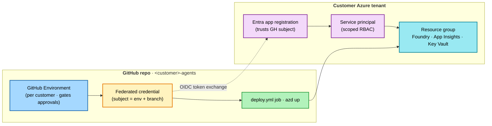

# 7. Provision the customer's Azure

*Step 7 of 10 · Deliver to a customer*

!!! info "Step at a glance"
    **🎯 Goal** — Stand up the customer's Foundry + supporting infra in their tenant via `azd up`, against a GitHub Environment that holds the customer's OIDC credentials.

    **📋 Prerequisite** — [6. Scaffold from the brief](03-scaffold-from-the-brief.md) complete — lint green; brief committed.

    **💻 Where you'll work** — VS Code (Copilot Chat + integrated terminal); GitHub web (Settings → Environments — `/deploy-to-env` walks you there); Azure portal (resource group inspection after).

    **✅ Done when** — Resource group exists in customer tenant; `/healthz` returns 200; Foundry agents are reachable; App Insights is wired; HITL approver endpoint is configured for the environment.

!!! tip "Chatmodes used here"
    [`/configure-landing-zone`](../../../.github/agents/configure-landing-zone.agent.md) · [`/deploy-to-env`](../../../.github/agents/deploy-to-env.agent.md)

    Full reference: [Chatmodes overview](../../agents-index.md).

??? success "What success looks like"
    `azd up` ends with a summary like:

    ```
    SUCCESS: Your application was provisioned and deployed to Azure in 12m 4s.
    You can view the resources created under the resource group rg-<customer>-dev in:
    https://portal.azure.com/...
    Endpoint: https://<api>.<region>.azurecontainerapps.io
    ```

    `curl <api-url>/healthz` returns:

    ```json
    {"status": "ok", "bootstrap": "complete"}
    ```

    The customer's resource group lists at least: AIServices account · model deployment · Foundry project · Container App · App Insights · Log Analytics · AI Search · Key Vault · User-Assigned MI.

---

This step is two preflight chatmodes plus one `azd up`. The chatmodes do the GitHub plumbing (manifest entry, GitHub Environment, OIDC federated credential) so CI can deploy without a service-principal secret.

## Preflight: pick a landing-zone tier

```
/configure-landing-zone
```

The chatmode walks the partner through three tiers:

- **Tier 1 — `standalone`** — single-RG, public endpoints, Entra-only. For pilots and SMB.
- **Tier 2 — `avm`** — Azure Verified Modules + private endpoints + private DNS. For mid-market.
- **Tier 3 — `alz-integrated`** — overlays the customer's existing AI ALZ hub via `infra/alz-overlay/`. For regulated / enterprise.

Tier choice writes to `accelerator.yaml -> landing_zone.mode` and selects the matching `infra/` shape. The lint rule `landing_zone_mode_consistent` enforces the match.

For regulated customers: set `controls.private_endpoints = required` (implies Tier 2 or Tier 3).

→ Detail: [Reference → Architecture & governance → Azure AI landing zone](../../patterns/azure-ai-landing-zone/README.md).

## Preflight: register the customer environment

```
/deploy-to-env <env-name>      # e.g., dev, uat, prod
```

The chatmode adds an entry to `deploy/environments.yaml`, creates the matching **GitHub Environment**, wires the OIDC federated credential between the customer's Entra app registration and the GitHub Environment, scopes the per-environment secrets (`AZURE_CLIENT_ID` / `AZURE_TENANT_ID` / `AZURE_SUBSCRIPTION_ID`) and variable (`AZURE_LOCATION`), and dispatches a first deploy.

!!! warning "Never hand-edit `deploy.yml` to add envs"
    The manifest + the `resolve-env` job is the contract; the `deploy_matrix_matches_azure_envs` lint rule rejects drift. The azd environment name is **always** derived from `deploy/environments.yaml` — never set `vars.AZURE_ENV_NAME`.

If the environment will gate side-effect tools through a webhook approver (Logic Apps, Teams, ServiceNow), set `HITL_APPROVER_ENDPOINT` as an Environment secret on the same screen. Failures to reach the approver are treated as rejections (fail-closed).



At handover, the federated credential is re-pointed to the customer's own repo — never hand-edit `deploy.yml`; `deploy/environments.yaml` is the contract.

## Provision + deploy

```bash
# Replace <customer-tenant-id> with the customer's Azure tenant GUID, and
# <customer-short-name> with the customer's short name (e.g., contoso)
az login --tenant <customer-tenant-id>
azd auth login
azd env new <customer-short-name>-dev
azd up
```

`azd up` provisions, in ~10–15 minutes:

- Cognitive Services account (`kind=AIServices`, GA)
- Default content filter (`accelerator-default-policy`) blocking Medium+ on Hate/Sexual/Violence/Selfharm
- Model deployment (default `gpt-5-mini`, `GlobalStandard`, 30 TPM) bound to the content filter
- Foundry project (`accelerator-default`)
- Azure AI Search · Key Vault (RBAC) · Container App · Log Analytics + App Insights
- User-assigned managed identity with Cognitive Services OpenAI User + Azure AI Developer roles

The deployed API URL prints at the end — keep it; the next step uses it.

## Confirm the deploy is healthy

```bash
# Replace <api-url> with the URL azd up printed
curl <api-url>/healthz
```

200 = bootstrap succeeded (Foundry agents synced from `docs/agent-specs/`, AI Search index seeded, content filter attached, MI roles propagated).

If `/healthz` returns 503, the FastAPI startup bootstrap is failing — most often RBAC propagation lag (1–3 minutes). Watch in App Insights:

```kusto
traces | where operation_Name == "lifespan.startup"
```

## Troubleshooting `azd up` and first boot

Customer deploys hit a small set of repeatable failure modes. Try these in order before re-running `azd up`.

??? failure "RBAC role hasn't propagated yet (most common)"
    **Symptom.** `/healthz` returns 503; App Insights `traces` show `Forbidden` from Cognitive Services or AI Search during `lifespan.startup`.

    **Cause.** Managed Identity role assignments take 1–3 minutes to propagate after `azd up` finishes.

    **Fix.** Wait 3 minutes, hit `/healthz` again. If still failing, confirm the User-Assigned MI has **Cognitive Services OpenAI User** + **Azure AI Developer** + **Search Index Data Contributor** in the resource group:

    ```bash
    az role assignment list --assignee <mi-principal-id> --scope <rg-id> -o table
    ```

??? failure "Model deployment quota exceeded in the chosen region"
    **Symptom.** `azd up` fails inside `Microsoft.CognitiveServices/accounts/deployments` with `InsufficientQuota` or `429`.

    **Cause.** The default model (`gpt-5-mini` GlobalStandard, 30 TPM) competes with other deployments in the region.

    **Fix.** Either request quota in Azure portal → Quotas → Cognitive Services, or pick a region with headroom in `infra/main.parameters.json -> location`, or downsize TPM in `accelerator.yaml -> models[].capacity` and re-run `azd up`.

??? failure "Foundry project failed to create"
    **Symptom.** `azd up` fails on `Microsoft.CognitiveServices/accounts/projects` resource.

    **Cause.** Either the AIServices account isn't fully provisioned yet, or the subscription isn't enrolled for AI Foundry projects in the selected region.

    **Fix.** Re-run `azd up` (idempotent — picks up where it left off). If it fails twice in the same place, check `https://ai.azure.com` lists the AIServices account and offers to create a project there manually.

??? failure "AI Search index never seeded"
    **Symptom.** `/healthz` returns 200, but agent calls fail with `ResourceNotFound` for the search index, or eval cases get `0` retrieval hits.

    **Cause.** The bootstrap ran before AI Search RBAC propagated, so the seed step was skipped.

    **Fix.** Restart the Container App revision (`az containerapp revision restart` or hit the **Restart** button in the portal). The startup bootstrap re-runs the seed step; verify with:

    ```kusto
    traces | where message contains "ai-search seed" | order by timestamp desc
    ```

??? failure "HITL approver endpoint not reachable"
    **Symptom.** Side-effect tools fail-closed; logs show `hitl.checkpoint -> approver_unreachable`.

    **Cause.** `HITL_APPROVER_ENDPOINT` Environment secret was not set when `/deploy-to-env` ran, or the URL points to an approver Logic App / webhook that isn't deployed yet.

    **Fix.** Set the secret in **GitHub → Settings → Environments → \<env-name\> → Add secret**, then `azd deploy` to roll the new value into the Container App config. Test with a contrived side-effect call from a unit test — fail-closed is by design and correct.

??? failure "Anything else"
    Capture App Insights traces for the failing operation:

    ```kusto
    union exceptions, traces
    | where timestamp > ago(15m) and severityLevel >= 2
    | order by timestamp desc
    ```

    For per-machine prerequisites that look broken (Python, gh, az, azd), see the Get-ready troubleshooting in [2. Set up your machine](../ready/02-set-up-your-machine.md#troubleshooting--top-5-per-machine).

---

**Continue →** [8. Iterate & evaluate](05-iterate-and-evaluate.md)
