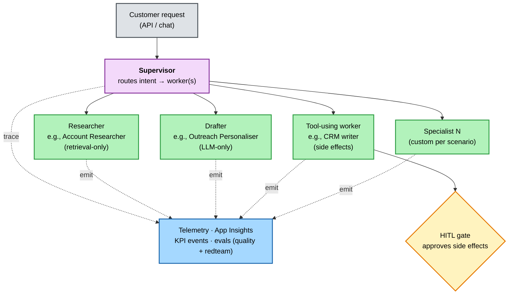

# 1. Get oriented

*Step 1 of 10 · Get ready*

!!! info "Step at a glance"
    **🎯 Goal** — Understand what the accelerator is, the supervisor + workers shape, and what's accelerator vs. partner-owned.

    **📋 Prerequisite** — None — you just landed on this site.

    **💻 Where you'll work** — Browser (this site).

    **✅ Done when** — You can name (a) what the accelerator gives you vs. what you still own, and (b) which steps are one-time vs. per-customer.

---

## What the accelerator is

A Microsoft-published **GitHub template repo** that partners clone — once per customer — to deliver an agentic AI solution into the customer's Azure subscription. It ships a working flagship scenario (Sales Research & Personalised Outreach), a full discovery → handover → measure motion, and the CI gates, evals, telemetry, and HITL plumbing a regulated production workload needs.

The platform is **Microsoft Agent Framework + Azure AI Foundry** — no other orchestration SDKs. Identity is **Managed Identity + Entra everywhere** — no keys, no connection strings.

## The shape: supervisor + workers

The flagship is one supervisor agent that routes a customer request across specialist workers and aggregates their outputs.

Each worker is stateless and declared in the `WORKERS` registry in `src/scenarios/<id>/workflow.py`. The flagship scenario (`sales_research`) ships Account Researcher, ICP / Fit Analyst, and Outreach Personaliser; your customer scenario will replace these with its own specialists.

Two simpler shapes are also supported via `/switch-to-variant`:
**single-agent** (no supervisor) and **chat-with-actioning** (conversational front-end).

## What the accelerator gives you vs. what you own

| The accelerator ships | You still own |
|---|---|
| Discovery chatmode, brief template, ROI calculator | Customer workshop facilitation |
| Scaffolders for new scenarios, agents, tools | Scenario-specific prompts, retrieval schema |
| Bicep infra (AVM-based) + `azd up` | Customer network / private-link overlay (if regulated) |
| CI gates: lint + quality evals + redteam | Branch protection, required reviewers |
| Telemetry baseline + dashboard schema | Customer dashboards, alerting thresholds |
| HITL contract (constant + checkpoint + lint + dev-mode stub) | The production approver (Logic Apps, Teams, ServiceNow) |
| Reference frontend starter | Real customer UX, branding, end-user auth, run-history persistence |
| **Nothing** — the SOW, customer training material | **You** — your partner practice owns those |

The full ownership boundary lives in [Delivery context → Partner playbook](../../partner-playbook.md#what-the-accelerator-gives-you-vs-what-you-still-own). Call it out explicitly in the SOW.

## Who does what

The walkthrough maps to **three responsibilities** — not three people. At a small partner, one person commonly wears both the Delivery Lead and Partner Engineer hats; Customer Ops is always customer-owned.

| Responsibility | What they own | Walkthrough steps |
|---|---|---|
| 🧭 **Delivery Lead** (partner) | Customer relationship, scope, discovery, ROI, UAT sign-off, handover meeting, monthly value review | 1–3 (read), 5 *Discover*, 9 *UAT & handover* |
| 🛠️ **Partner Engineer** (partner) | Scaffolding, infra, evals, HITL wiring, frontend, CI gates, UAT support | 1–3 (do), 4 *Clone*, 6 *Scaffold*, 7 *Provision*, 8 *Iterate*, 9 *UAT support* |
| 🏛️ **Customer Ops** (customer) | Day-2 monitoring, killswitch, eval re-run, secret rotation, model swap, incident response | 10 *Operate (Day 2)* — owns it from handover onward |

> **Small partner?** Same person does Delivery Lead + Partner Engineer steps; the labels just clarify *which hat* you're wearing for each step.

## One-time vs. per-customer

| Step | When |
|---|---|
| 1. Get oriented (here) | Once |
| 2. Set up your machine | Once per partner machine |
| 3. Rehearse in a sandbox | Once per partner engineer, before first customer |
| 4. Clone for the customer | Per engagement |
| 5. Discover with the customer | Per engagement |
| 6. Scaffold from the brief | Per engagement |
| 7. Provision the customer's Azure | Per engagement |
| 8. Iterate & evaluate | Per engagement (continuous) |
| 9. UAT & handover | Per engagement |
| 10. Operate (Day 2) | Per engagement (ongoing) |

---

**Continue →** [2. Set up your machine](02-set-up-your-machine.md)
